# System Diagrams - Legacy and Reengineered POS System

## Table of Contents
1. [Legacy System Architecture](#legacy-system-architecture)
2. [Reengineered System Architecture](#reengineered-system-architecture)
3. [Legacy Class Diagrams](#legacy-class-diagrams)
4. [Reengineered Class Diagrams](#reengineered-class-diagrams)
5. [Sequence Diagrams](#sequence-diagrams)
6. [Entity Relationship Diagrams](#entity-relationship-diagrams)
7. [Component Diagrams](#component-diagrams)
8. [Deployment Diagrams](#deployment-diagrams)
9. [Data Flow Diagrams](#data-flow-diagrams)
10. [State Diagrams](#state-diagrams)

---

## Legacy System Architecture

### High-Level Architecture

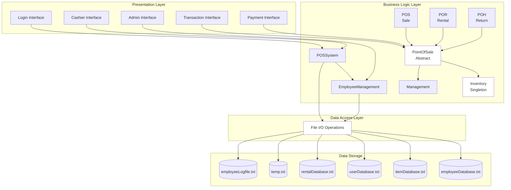
```mermaid
graph TB
    subgraph "Presentation Layer"
        Login[Login Interface]
        Cashier[Cashier Interface]
        Admin[Admin Interface]
        Transaction[Transaction Interface]
        Payment[Payment Interface]
    end
    
    subgraph "Business Logic Layer"
        POSSystem[POSSystem]
        EmployeeMgmt[EmployeeManagement]
        PointOfSale[PointOfSale<br/>Abstract]
        POS[POS<br/>Sale]
        POR[POR<br/>Rental]
        POH[POH<br/>Return]
        Inventory[Inventory<br/>Singleton]
        Management[Management]
    end
    
    subgraph "Data Access Layer"
        FileIO[File I/O Operations]
    end
    
    subgraph "Data Storage"
        EmpDB[(employeeDatabase.txt)]
        ItemDB[(itemDatabase.txt)]
        UserDB[(userDatabase.txt)]
        RentalDB[(rentalDatabase.txt)]
        TempFile[(temp.txt)]
        LogFile[(employeeLogfile.txt)]
    end
    
    Login --> POSSystem
    Cashier --> POSSystem
    Admin --> EmployeeMgmt
    Transaction --> PointOfSale
    Payment --> PointOfSale
    
    POSSystem --> EmployeeMgmt
    POSSystem --> FileIO
    EmployeeMgmt --> FileIO
    PointOfSale --> Inventory
    PointOfSale --> Management
    POS --> PointOfSale
    POR --> PointOfSale
    POH --> PointOfSale
    
    FileIO --> EmpDB
    FileIO --> ItemDB
    FileIO --> UserDB
    FileIO --> RentalDB
    FileIO --> TempFile
    FileIO --> LogFile
    
    style PointOfSale fill:#ffffff
    style Inventory fill:#ffffff
    style FileIO fill:#ffffff
```

### Legacy System Component Diagram

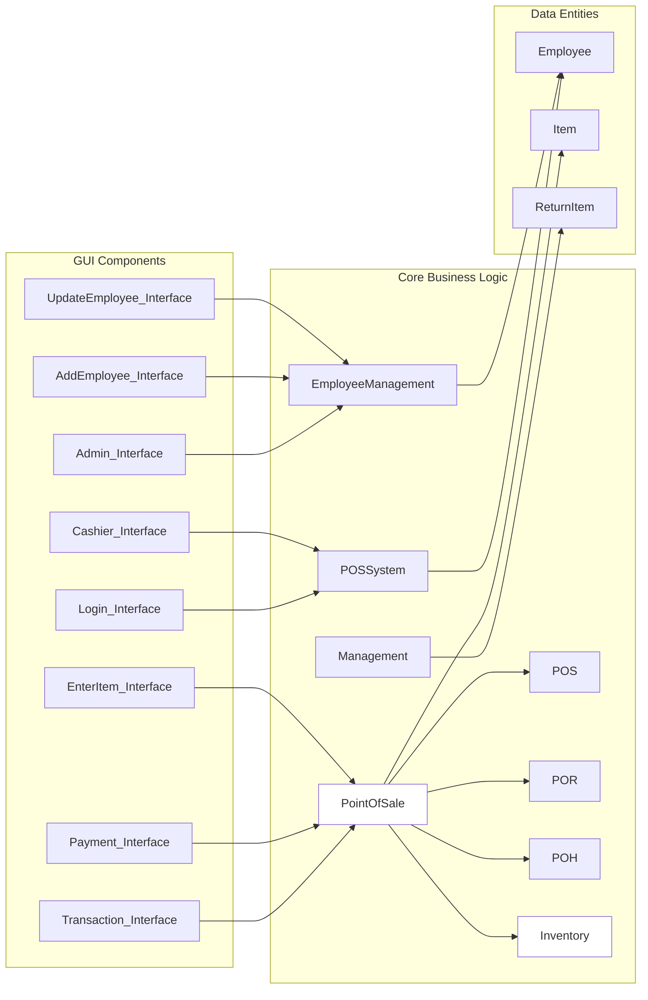
```mermaid
graph LR
    subgraph "GUI Components"
        A[Login_Interface]
        B[Cashier_Interface]
        C[Admin_Interface]
        D[Transaction_Interface]
        E[Payment_Interface]
        F[EnterItem_Interface]
        G[AddEmployee_Interface]
        H[UpdateEmployee_Interface]
    end
    
    subgraph "Core Business Logic"
        I[POSSystem]
        J[EmployeeManagement]
        K[PointOfSale]
        L[POS]
        M[POR]
        N[POH]
        O[Inventory]
        P[Management]
    end
    
    subgraph "Data Entities"
        Q[Employee]
        R[Item]
        S[ReturnItem]
    end
    
    A --> I
    B --> I
    C --> J
    D --> K
    E --> K
    F --> K
    G --> J
    H --> J
    
    I --> Q
    J --> Q
    K --> L
    K --> M
    K --> N
    K --> O
    K --> R
    P --> S
    
    style O fill:#ffffff
    style K fill:#ffffff
```

---

## Reengineered System Architecture

### Three-Tier Web Architecture

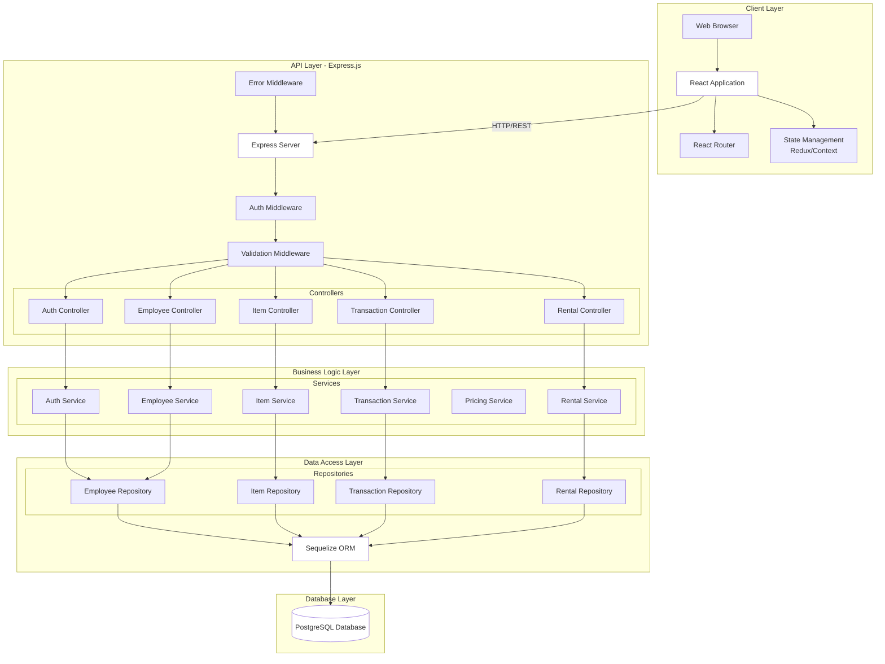
```mermaid
graph TB
    subgraph "Client Layer"
        Browser[Web Browser]
        React[React Application]
        Router[React Router]
        State[State Management<br/>Redux/Context]
    end
    
    subgraph "API Layer - Express.js"
        API[Express Server]
        AuthMW[Auth Middleware]
        ValidMW[Validation Middleware]
        ErrorMW[Error Middleware]
        
        subgraph "Controllers"
            AuthCtrl[Auth Controller]
            ItemCtrl[Item Controller]
            TransCtrl[Transaction Controller]
            RentalCtrl[Rental Controller]
            EmpCtrl[Employee Controller]
        end
    end
    
    subgraph "Business Logic Layer"
        subgraph "Services"
            AuthSvc[Auth Service]
            ItemSvc[Item Service]
            TransSvc[Transaction Service]
            RentalSvc[Rental Service]
            PricingSvc[Pricing Service]
            EmpSvc[Employee Service]
        end
    end
    
    subgraph "Data Access Layer"
        subgraph "Repositories"
            EmpRepo[Employee Repository]
            ItemRepo[Item Repository]
            TransRepo[Transaction Repository]
            RentalRepo[Rental Repository]
        end
        ORM[Sequelize ORM]
    end
    
    subgraph "Database Layer"
        PostgreSQL[(PostgreSQL Database)]
    end
    
    Browser --> React
    React --> Router
    React --> State
    React -->|HTTP/REST| API
    
    API --> AuthMW
    AuthMW --> ValidMW
    ValidMW --> AuthCtrl
    ValidMW --> ItemCtrl
    ValidMW --> TransCtrl
    ValidMW --> RentalCtrl
    ValidMW --> EmpCtrl
    
    AuthCtrl --> AuthSvc
    ItemCtrl --> ItemSvc
    TransCtrl --> TransSvc
    RentalCtrl --> RentalSvc
    EmpCtrl --> EmpSvc
    
    AuthSvc --> EmpRepo
    ItemSvc --> ItemRepo
    TransSvc --> TransRepo
    RentalSvc --> RentalRepo
    EmpSvc --> EmpRepo
    
    EmpRepo --> ORM
    ItemRepo --> ORM
    TransRepo --> ORM
    RentalRepo --> ORM
    
    ORM --> PostgreSQL
    
    ErrorMW --> API
    
    style React fill:#ffffff
    style API fill:#ffffff
    style PostgreSQL fill:#ffffff
    style ORM fill:#ffffff
```

### Reengineered System Component Diagram

```mermaid
graph TB
    subgraph "Frontend - React"
        subgraph "Pages"
            LoginPage[Login Page]
            Dashboard[Dashboard Page]
            SalesPage[Sales Page]
            RentalsPage[Rentals Page]
            ReturnsPage[Returns Page]
            InventoryPage[Inventory Page]
            EmpMgmtPage[Employee Management]
        end
        
        subgraph "Components"
            LoginForm[Login Form]
            ItemList[Item List]
            TransactionForm[Transaction Form]
            Cart[Shopping Cart]
            PaymentForm[Payment Form]
        end
        
        subgraph "Services"
            AuthAPI[Auth API Service]
            ItemAPI[Item API Service]
            TransAPI[Transaction API Service]
        end
        
        subgraph "State"
            AuthStore[Auth Store]
            ItemStore[Item Store]
            CartStore[Cart Store]
        end
    end
    
    subgraph "Backend - Express"
        subgraph "Routes"
            AuthRoute[/api/auth]
            ItemRoute[/api/items]
            TransRoute[/api/transactions]
            RentalRoute[/api/rentals]
        end
        
        subgraph "Controllers"
            AuthController[Auth Controller]
            ItemController[Item Controller]
            TransController[Transaction Controller]
        end
        
        subgraph "Services"
            AuthService[Auth Service]
            ItemService[Item Service]
            TransService[Transaction Service]
            PricingService[Pricing Service]
        end
        
        subgraph "Repositories"
            EmpRepository[Employee Repository]
            ItemRepository[Item Repository]
            TransRepository[Transaction Repository]
        end
    end
    
    subgraph "Database"
        DB[(PostgreSQL)]
    end
    
    LoginPage --> LoginForm
    SalesPage --> TransactionForm
    SalesPage --> Cart
    TransactionForm --> PaymentForm
    
    LoginForm --> AuthAPI
    ItemList --> ItemAPI
    TransactionForm --> TransAPI
    
    AuthAPI --> AuthStore
    ItemAPI --> ItemStore
    TransAPI --> CartStore
    
    AuthAPI --> AuthRoute
    ItemAPI --> ItemRoute
    TransAPI --> TransRoute
    
    AuthRoute --> AuthController
    ItemRoute --> ItemController
    TransRoute --> TransController
    
    AuthController --> AuthService
    ItemController --> ItemService
    TransController --> TransService
    
    AuthService --> EmpRepository
    ItemService --> ItemRepository
    TransService --> TransRepository
    
    EmpRepository --> DB
    ItemRepository --> DB
    TransRepository --> DB
    
    style LoginPage fill:#ffffff
    style AuthService fill:#ffffff
    style DB fill:#ffffff
```

---

## Legacy Class Diagrams

### Core Class Relationships

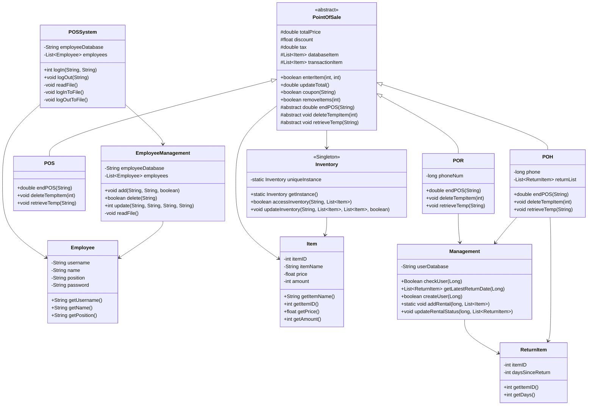
```mermaid
classDiagram
    class POSSystem {
        -String employeeDatabase
        -List~Employee~ employees
        +int logIn(String, String)
        +void logOut(String)
        -void readFile()
        -void logInToFile()
        -void logOutToFile()
    }
    
    class Employee {
        -String username
        -String name
        -String position
        -String password
        +String getUsername()
        +String getName()
        +String getPosition()
    }
    
    class EmployeeManagement {
        -String employeeDatabase
        -List~Employee~ employees
        +void add(String, String, boolean)
        +boolean delete(String)
        +int update(String, String, String, String)
        -void readFile()
    }
    
    class PointOfSale {
        <<abstract>>
        #double totalPrice
        #float discount
        #double tax
        #List~Item~ databaseItem
        #List~Item~ transactionItem
        +boolean enterItem(int, int)
        +double updateTotal()
        +boolean coupon(String)
        +boolean removeItems(int)
        #abstract double endPOS(String)
        #abstract void deleteTempItem(int)
        #abstract void retrieveTemp(String)
    }
    
    class POS {
        +double endPOS(String)
        +void deleteTempItem(int)
        +void retrieveTemp(String)
    }
    
    class POR {
        -long phoneNum
        +double endPOS(String)
        +void deleteTempItem(int)
        +void retrieveTemp(String)
    }
    
    class POH {
        -long phone
        -List~ReturnItem~ returnList
        +double endPOS(String)
        +void deleteTempItem(int)
        +void retrieveTemp(String)
    }
    
    class Inventory {
        <<Singleton>>
        -static Inventory uniqueInstance
        +static Inventory getInstance()
        +boolean accessInventory(String, List~Item~)
        +void updateInventory(String, List~Item~, List~Item~, boolean)
    }
    
    class Item {
        -int itemID
        -String itemName
        -float price
        -int amount
        +String getItemName()
        +int getItemID()
        +float getPrice()
        +int getAmount()
    }
    
    class Management {
        -String userDatabase
        +Boolean checkUser(Long)
        +List~ReturnItem~ getLatestReturnDate(Long)
        +boolean createUser(Long)
        +static void addRental(long, List~Item~)
        +void updateRentalStatus(long, List~ReturnItem~)
    }
    
    class ReturnItem {
        -int itemID
        -int daysSinceReturn
        +int getItemID()
        +int getDays()
    }
    
    POSSystem --> Employee
    POSSystem --> EmployeeManagement
    EmployeeManagement --> Employee
    PointOfSale <|-- POS
    PointOfSale <|-- POR
    PointOfSale <|-- POH
    PointOfSale --> Inventory
    PointOfSale --> Item
    Inventory --> Item
    Management --> ReturnItem
    POH --> ReturnItem
    POR --> Management
    POH --> Management
```

---

## Reengineered Class Diagrams

### Backend Class Structure

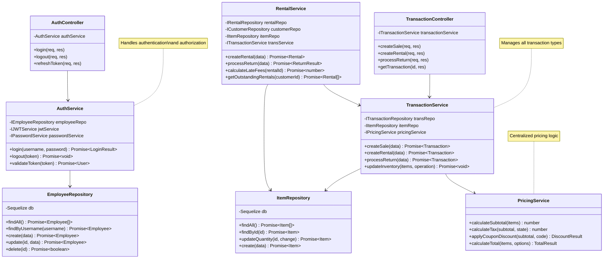
```mermaid
classDiagram
    class AuthController {
        -AuthService authService
        +login(req, res)
        +logout(req, res)
        +refreshToken(req, res)
    }
    
    class AuthService {
        -IEmployeeRepository employeeRepo
        -IJWTService jwtService
        -IPasswordService passwordService
        +login(username, password) Promise~LoginResult~
        +logout(token) Promise~void~
        +validateToken(token) Promise~User~
    }
    
    class EmployeeRepository {
        -Sequelize db
        +findAll() Promise~Employee[]~
        +findByUsername(username) Promise~Employee~
        +create(data) Promise~Employee~
        +update(id, data) Promise~Employee~
        +delete(id) Promise~boolean~
    }
    
    class TransactionController {
        -ITransactionService transactionService
        +createSale(req, res)
        +createRental(req, res)
        +processReturn(req, res)
        +getTransaction(id, res)
    }
    
    class TransactionService {
        -ITransactionRepository transRepo
        -IItemRepository itemRepo
        -IPricingService pricingService
        +createSale(data) Promise~Transaction~
        +createRental(data) Promise~Transaction~
        +processReturn(data) Promise~Transaction~
        +updateInventory(items, operation) Promise~void~
    }
    
    class PricingService {
        +calculateSubtotal(items) number
        +calculateTax(subtotal, state) number
        +applyCouponDiscount(subtotal, code) DiscountResult
        +calculateTotal(items, options) TotalResult
    }
    
    class ItemRepository {
        -Sequelize db
        +findAll() Promise~Item[]~
        +findById(id) Promise~Item~
        +updateQuantity(id, change) Promise~Item~
        +create(data) Promise~Item~
    }
    
    class RentalService {
        -IRentalRepository rentalRepo
        -ICustomerRepository customerRepo
        -IItemRepository itemRepo
        -ITransactionService transService
        +createRental(data) Promise~Rental~
        +processReturn(data) Promise~ReturnResult~
        +calculateLateFees(rentalId) Promise~number~
        +getOutstandingRentals(customerId) Promise~Rental[]~
    }
    
    AuthController --> AuthService
    AuthService --> EmployeeRepository
    TransactionController --> TransactionService
    TransactionService --> ItemRepository
    TransactionService --> PricingService
    RentalService --> ItemRepository
    RentalService --> TransactionService
    
    note for AuthService "Handles authentication\nand authorization"
    note for TransactionService "Manages all transaction types"
    note for PricingService "Centralized pricing logic"
```

### Frontend Component Structure

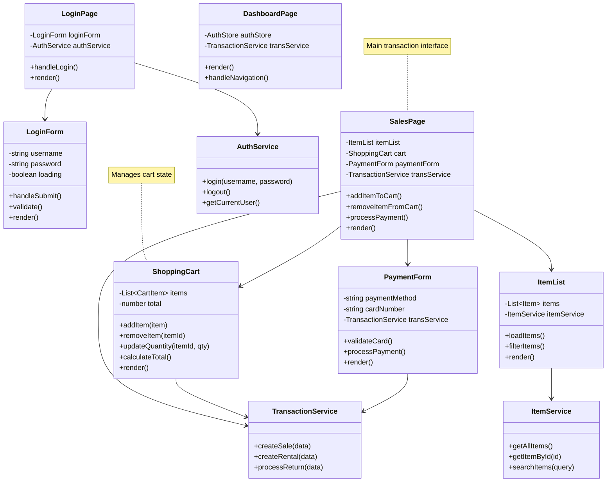
```mermaid
classDiagram
    class LoginPage {
        -LoginForm loginForm
        -AuthService authService
        +handleLogin()
        +render()
    }
    
    class LoginForm {
        -string username
        -string password
        -boolean loading
        +handleSubmit()
        +validate()
        +render()
    }
    
    class DashboardPage {
        -AuthStore authStore
        -TransactionService transService
        +render()
        +handleNavigation()
    }
    
    class SalesPage {
        -ItemList itemList
        -ShoppingCart cart
        -PaymentForm paymentForm
        -TransactionService transService
        +addItemToCart()
        +removeItemFromCart()
        +processPayment()
        +render()
    }
    
    class ShoppingCart {
        -List~CartItem~ items
        -number total
        +addItem(item)
        +removeItem(itemId)
        +updateQuantity(itemId, qty)
        +calculateTotal()
        +render()
    }
    
    class ItemList {
        -List~Item~ items
        -ItemService itemService
        +loadItems()
        +filterItems()
        +render()
    }
    
    class PaymentForm {
        -string paymentMethod
        -string cardNumber
        -TransactionService transService
        +validateCard()
        +processPayment()
        +render()
    }
    
    class AuthService {
        +login(username, password)
        +logout()
        +getCurrentUser()
    }
    
    class TransactionService {
        +createSale(data)
        +createRental(data)
        +processReturn(data)
    }
    
    class ItemService {
        +getAllItems()
        +getItemById(id)
        +searchItems(query)
    }
    
    LoginPage --> LoginForm
    LoginPage --> AuthService
    SalesPage --> ItemList
    SalesPage --> ShoppingCart
    SalesPage --> PaymentForm
    SalesPage --> TransactionService
    ShoppingCart --> TransactionService
    ItemList --> ItemService
    PaymentForm --> TransactionService
    
    note for SalesPage "Main transaction interface"
    note for ShoppingCart "Manages cart state"
```

---

## Sequence Diagrams

### Legacy System - Login Sequence

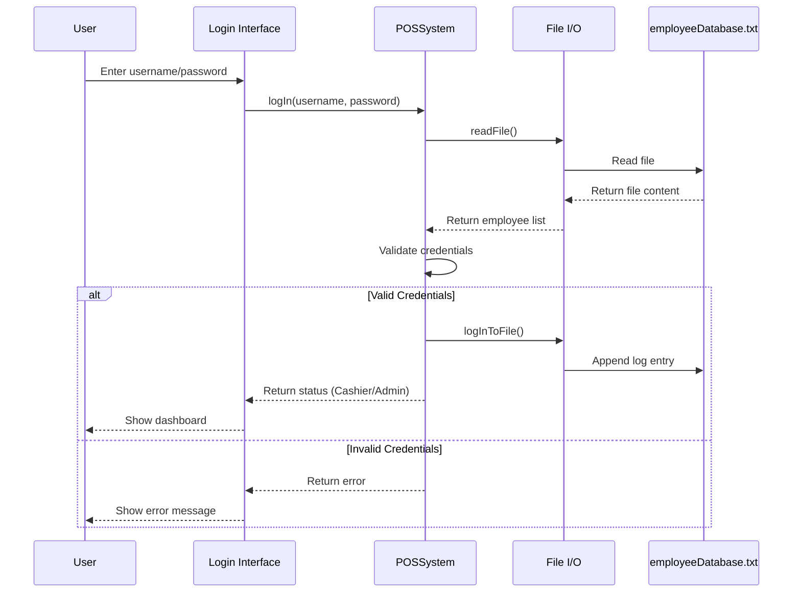
```mermaid
sequenceDiagram
    participant User
    participant LoginUI as Login Interface
    participant POSSystem
    participant FileIO as File I/O
    participant EmpDB as employeeDatabase.txt
    
    User->>LoginUI: Enter username/password
    LoginUI->>POSSystem: logIn(username, password)
    POSSystem->>FileIO: readFile()
    FileIO->>EmpDB: Read file
    EmpDB-->>FileIO: Return file content
    FileIO-->>POSSystem: Return employee list
    POSSystem->>POSSystem: Validate credentials
    alt Valid Credentials
        POSSystem->>FileIO: logInToFile()
        FileIO->>EmpDB: Append log entry
        POSSystem-->>LoginUI: Return status (Cashier/Admin)
        LoginUI-->>User: Show dashboard
    else Invalid Credentials
        POSSystem-->>LoginUI: Return error
        LoginUI-->>User: Show error message
    end
```

### Reengineered System - Login Sequence

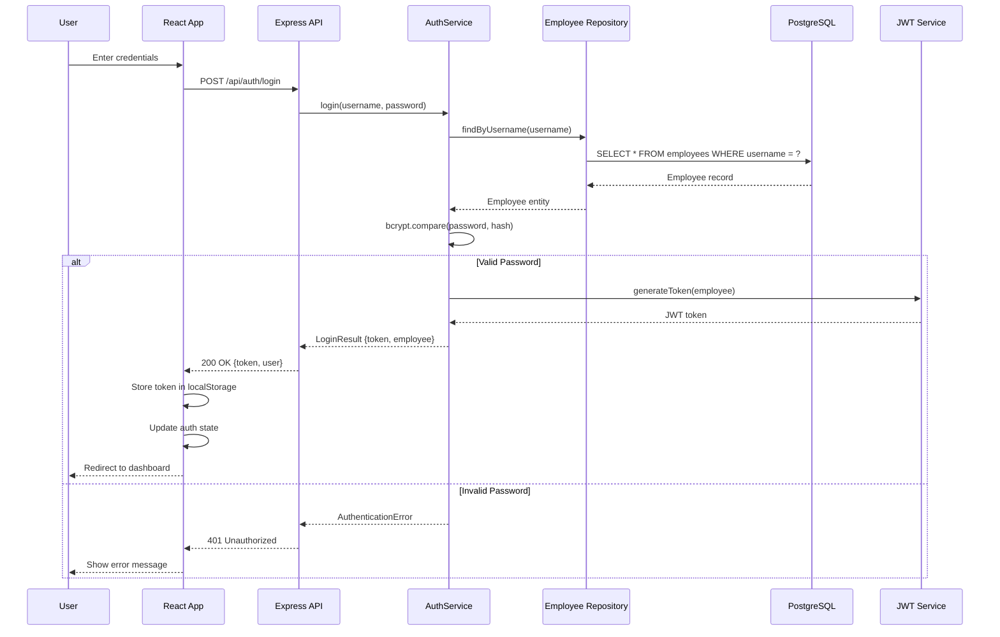
```mermaid
sequenceDiagram
    participant User
    participant React as React App
    participant API as Express API
    participant AuthService
    participant EmpRepo as Employee Repository
    participant DB as PostgreSQL
    participant JWT as JWT Service
    
    User->>React: Enter credentials
    React->>API: POST /api/auth/login
    API->>AuthService: login(username, password)
    AuthService->>EmpRepo: findByUsername(username)
    EmpRepo->>DB: SELECT * FROM employees WHERE username = ?
    DB-->>EmpRepo: Employee record
    EmpRepo-->>AuthService: Employee entity
    AuthService->>AuthService: bcrypt.compare(password, hash)
    alt Valid Password
        AuthService->>JWT: generateToken(employee)
        JWT-->>AuthService: JWT token
        AuthService-->>API: LoginResult {token, employee}
        API-->>React: 200 OK {token, user}
        React->>React: Store token in localStorage
        React->>React: Update auth state
        React-->>User: Redirect to dashboard
    else Invalid Password
        AuthService-->>API: AuthenticationError
        API-->>React: 401 Unauthorized
        React-->>User: Show error message
    end
```

### Sale Transaction Sequence

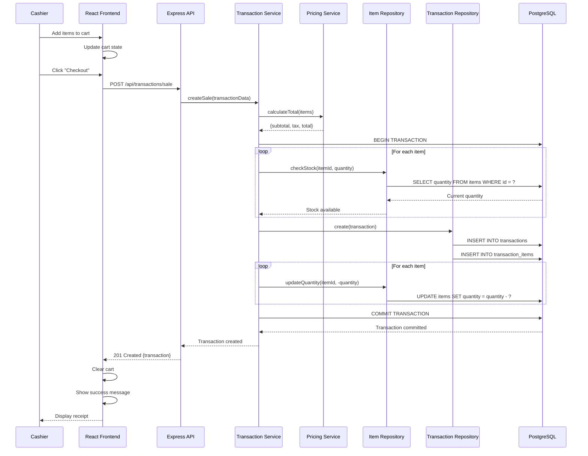
```mermaid
sequenceDiagram
    participant Cashier
    participant React as React Frontend
    participant API as Express API
    participant TransService as Transaction Service
    participant PricingService as Pricing Service
    participant ItemRepo as Item Repository
    participant TransRepo as Transaction Repository
    participant DB as PostgreSQL
    
    Cashier->>React: Add items to cart
    React->>React: Update cart state
    Cashier->>React: Click "Checkout"
    React->>API: POST /api/transactions/sale
    API->>TransService: createSale(transactionData)
    
    TransService->>PricingService: calculateTotal(items)
    PricingService-->>TransService: {subtotal, tax, total}
    
    TransService->>DB: BEGIN TRANSACTION
    
    loop For each item
        TransService->>ItemRepo: checkStock(itemId, quantity)
        ItemRepo->>DB: SELECT quantity FROM items WHERE id = ?
        DB-->>ItemRepo: Current quantity
        ItemRepo-->>TransService: Stock available
    end
    
    TransService->>TransRepo: create(transaction)
    TransRepo->>DB: INSERT INTO transactions
    TransRepo->>DB: INSERT INTO transaction_items
    
    loop For each item
        TransService->>ItemRepo: updateQuantity(itemId, -quantity)
        ItemRepo->>DB: UPDATE items SET quantity = quantity - ?
    end
    
    TransService->>DB: COMMIT TRANSACTION
    DB-->>TransService: Transaction committed
    TransService-->>API: Transaction created
    API-->>React: 201 Created {transaction}
    React->>React: Clear cart
    React->>React: Show success message
    React-->>Cashier: Display receipt
```

### Rental Transaction Sequence

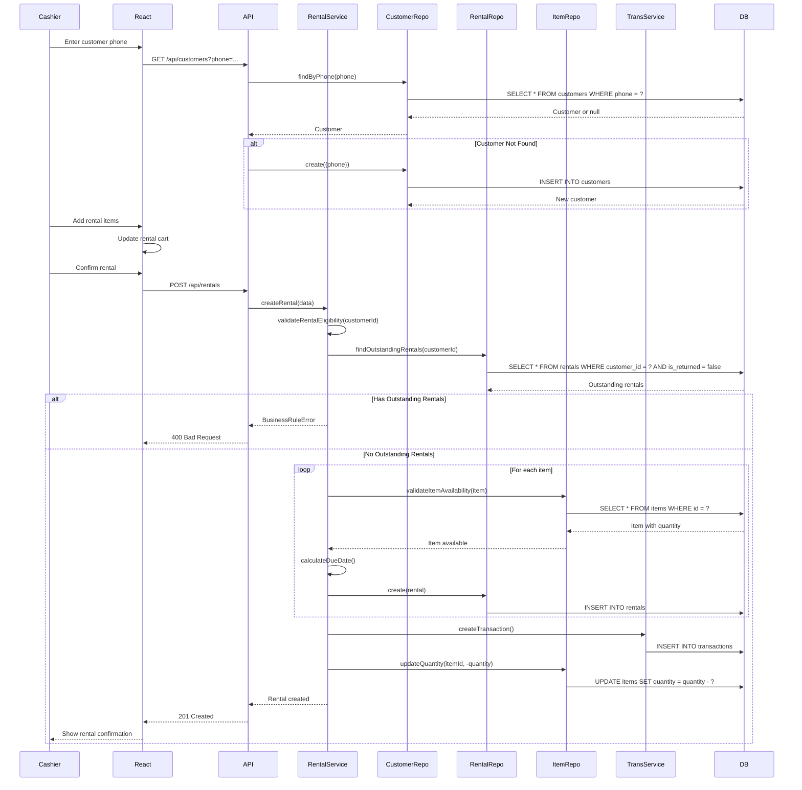
```mermaid
sequenceDiagram
    participant Cashier
    participant React
    participant API
    participant RentalService
    participant CustomerRepo
    participant RentalRepo
    participant ItemRepo
    participant TransService
    participant DB
    
    Cashier->>React: Enter customer phone
    React->>API: GET /api/customers?phone=...
    API->>CustomerRepo: findByPhone(phone)
    CustomerRepo->>DB: SELECT * FROM customers WHERE phone = ?
    DB-->>CustomerRepo: Customer or null
    CustomerRepo-->>API: Customer
    
    alt Customer Not Found
        API->>CustomerRepo: create({phone})
        CustomerRepo->>DB: INSERT INTO customers
        DB-->>CustomerRepo: New customer
    end
    
    Cashier->>React: Add rental items
    React->>React: Update rental cart
    Cashier->>React: Confirm rental
    React->>API: POST /api/rentals
    API->>RentalService: createRental(data)
    
    RentalService->>RentalService: validateRentalEligibility(customerId)
    RentalService->>RentalRepo: findOutstandingRentals(customerId)
    RentalRepo->>DB: SELECT * FROM rentals WHERE customer_id = ? AND is_returned = false
    DB-->>RentalRepo: Outstanding rentals
    
    alt Has Outstanding Rentals
        RentalService-->>API: BusinessRuleError
        API-->>React: 400 Bad Request
    else No Outstanding Rentals
        loop For each item
            RentalService->>ItemRepo: validateItemAvailability(item)
            ItemRepo->>DB: SELECT * FROM items WHERE id = ?
            DB-->>ItemRepo: Item with quantity
            ItemRepo-->>RentalService: Item available
            
            RentalService->>RentalService: calculateDueDate()
            RentalService->>RentalRepo: create(rental)
            RentalRepo->>DB: INSERT INTO rentals
        end
        
        RentalService->>TransService: createTransaction()
        TransService->>DB: INSERT INTO transactions
        RentalService->>ItemRepo: updateQuantity(itemId, -quantity)
        ItemRepo->>DB: UPDATE items SET quantity = quantity - ?
        
        RentalService-->>API: Rental created
        API-->>React: 201 Created
        React-->>Cashier: Show rental confirmation
    end
```

---

## Entity Relationship Diagrams

### Legacy Data Model (Conceptual)

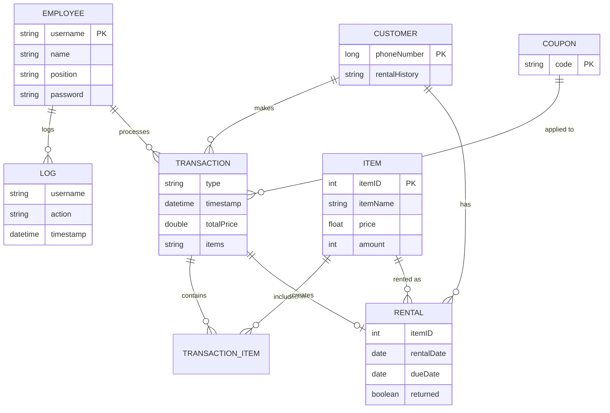
```mermaid
erDiagram
    EMPLOYEE ||--o{ LOG : "logs"
    EMPLOYEE ||--o{ TRANSACTION : "processes"
    CUSTOMER ||--o{ TRANSACTION : "makes"
    CUSTOMER ||--o{ RENTAL : "has"
    ITEM ||--o{ TRANSACTION_ITEM : "included in"
    ITEM ||--o{ RENTAL : "rented as"
    TRANSACTION ||--o{ TRANSACTION_ITEM : "contains"
    TRANSACTION ||--o| RENTAL : "creates"
    COUPON ||--o{ TRANSACTION : "applied to"
    
    EMPLOYEE {
        string username PK
        string name
        string position
        string password
    }
    
    ITEM {
        int itemID PK
        string itemName
        float price
        int amount
    }
    
    CUSTOMER {
        long phoneNumber PK
        string rentalHistory
    }
    
    TRANSACTION {
        string type
        datetime timestamp
        double totalPrice
        string items
    }
    
    RENTAL {
        int itemID
        date rentalDate
        date dueDate
        boolean returned
    }
    
    COUPON {
        string code PK
    }
    
    LOG {
        string username
        string action
        datetime timestamp
    }
```

### Reengineered Database Schema

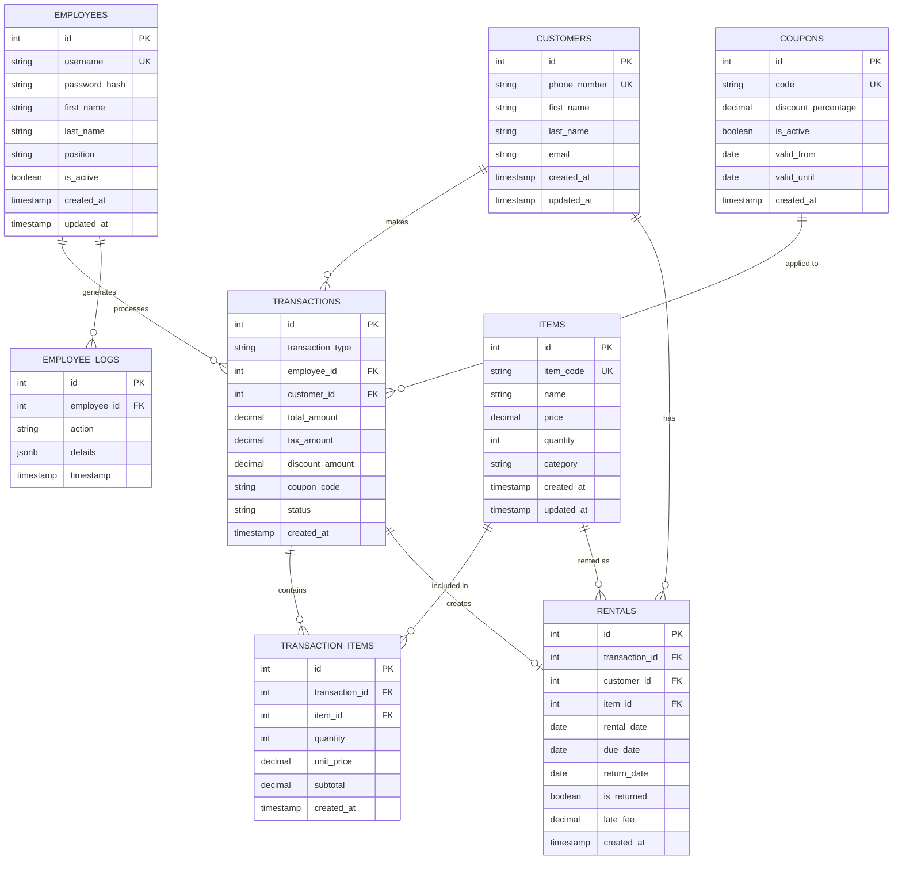
```mermaid
erDiagram
    EMPLOYEES ||--o{ TRANSACTIONS : "processes"
    EMPLOYEES ||--o{ EMPLOYEE_LOGS : "generates"
    CUSTOMERS ||--o{ TRANSACTIONS : "makes"
    CUSTOMERS ||--o{ RENTALS : "has"
    ITEMS ||--o{ TRANSACTION_ITEMS : "included in"
    ITEMS ||--o{ RENTALS : "rented as"
    TRANSACTIONS ||--o{ TRANSACTION_ITEMS : "contains"
    TRANSACTIONS ||--o| RENTALS : "creates"
    COUPONS ||--o{ TRANSACTIONS : "applied to"
    
    EMPLOYEES {
        int id PK
        string username UK
        string password_hash
        string first_name
        string last_name
        string position
        boolean is_active
        timestamp created_at
        timestamp updated_at
    }
    
    ITEMS {
        int id PK
        string item_code UK
        string name
        decimal price
        int quantity
        string category
        timestamp created_at
        timestamp updated_at
    }
    
    CUSTOMERS {
        int id PK
        string phone_number UK
        string first_name
        string last_name
        string email
        timestamp created_at
        timestamp updated_at
    }
    
    TRANSACTIONS {
        int id PK
        string transaction_type
        int employee_id FK
        int customer_id FK
        decimal total_amount
        decimal tax_amount
        decimal discount_amount
        string coupon_code
        string status
        timestamp created_at
    }
    
    TRANSACTION_ITEMS {
        int id PK
        int transaction_id FK
        int item_id FK
        int quantity
        decimal unit_price
        decimal subtotal
        timestamp created_at
    }
    
    RENTALS {
        int id PK
        int transaction_id FK
        int customer_id FK
        int item_id FK
        date rental_date
        date due_date
        date return_date
        boolean is_returned
        decimal late_fee
        timestamp created_at
    }
    
    COUPONS {
        int id PK
        string code UK
        decimal discount_percentage
        boolean is_active
        date valid_from
        date valid_until
        timestamp created_at
    }
    
    EMPLOYEE_LOGS {
        int id PK
        int employee_id FK
        string action
        jsonb details
        timestamp timestamp
    }
```

---

## Component Diagrams

### Legacy System Components

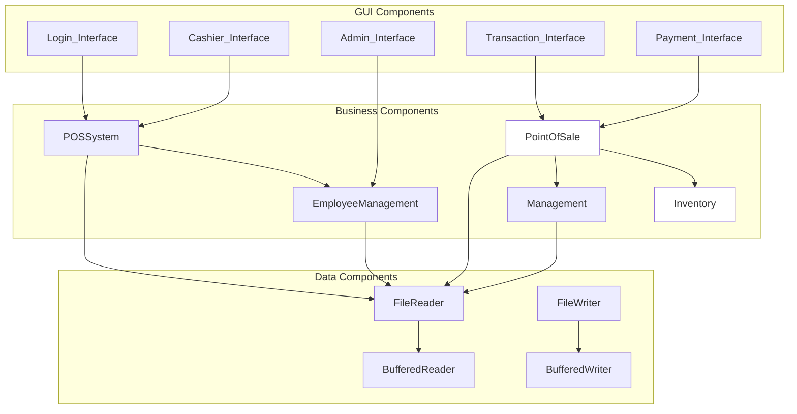
```mermaid
graph TB
    subgraph "GUI Components"
        A[Login_Interface]
        B[Cashier_Interface]
        C[Admin_Interface]
        D[Transaction_Interface]
        E[Payment_Interface]
    end
    
    subgraph "Business Components"
        F[POSSystem]
        G[EmployeeManagement]
        H[PointOfSale]
        I[Inventory]
        J[Management]
    end
    
    subgraph "Data Components"
        K[FileReader]
        L[FileWriter]
        M[BufferedReader]
        N[BufferedWriter]
    end
    
    A --> F
    B --> F
    C --> G
    D --> H
    E --> H
    
    F --> G
    H --> I
    H --> J
    
    F --> K
    G --> K
    H --> K
    J --> K
    
    K --> M
    L --> N
    
    style I fill:#ffffff
    style H fill:#ffffff
```

### Reengineered System Components

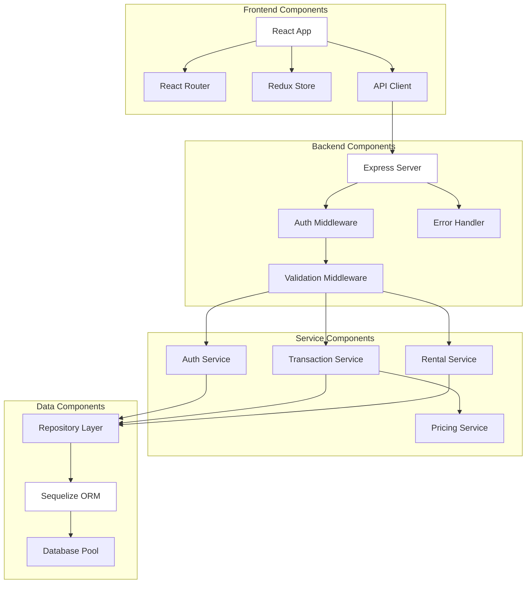
```mermaid
graph TB
    subgraph "Frontend Components"
        A[React App]
        B[React Router]
        C[Redux Store]
        D[API Client]
    end
    
    subgraph "Backend Components"
        E[Express Server]
        F[Auth Middleware]
        G[Validation Middleware]
        H[Error Handler]
    end
    
    subgraph "Service Components"
        I[Auth Service]
        J[Transaction Service]
        K[Pricing Service]
        L[Rental Service]
    end
    
    subgraph "Data Components"
        M[Sequelize ORM]
        N[Repository Layer]
        O[Database Pool]
    end
    
    A --> B
    A --> C
    A --> D
    
    D --> E
    E --> F
    F --> G
    G --> I
    G --> J
    G --> L
    
    I --> N
    J --> K
    J --> N
    L --> N
    
    N --> M
    M --> O
    
    E --> H
    
    style A fill:#ffffff
    style E fill:#ffffff
    style M fill:#ffffff
```

---

## Deployment Diagrams

### Legacy System Deployment

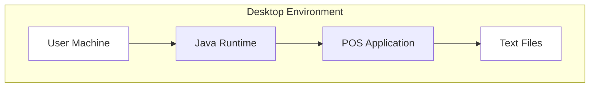
```mermaid
graph TB
    subgraph "Desktop Environment"
        A[User Machine]
        B[Java Runtime]
        C[POS Application]
        D[Text Files]
    end
    
    A --> B
    B --> C
    C --> D
    
    style A fill:#ffffff
    style D fill:#ffffff
```

### Reengineered System Deployment

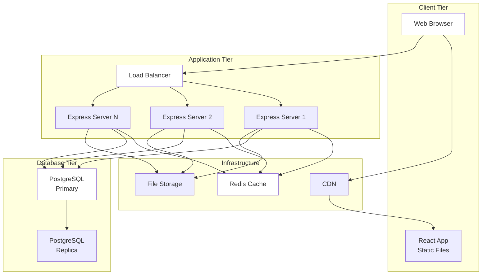
```mermaid
graph TB
    subgraph "Client Tier"
        A[Web Browser]
        B[React App<br/>Static Files]
    end
    
    subgraph "Application Tier"
        C[Load Balancer]
        D[Express Server 1]
        E[Express Server 2]
        F[Express Server N]
    end
    
    subgraph "Database Tier"
        G[PostgreSQL<br/>Primary]
        H[PostgreSQL<br/>Replica]
    end
    
    subgraph "Infrastructure"
        I[CDN]
        J[Redis Cache]
        K[File Storage]
    end
    
    A --> I
    I --> B
    A --> C
    C --> D
    C --> E
    C --> F
    
    D --> J
    E --> J
    F --> J
    
    D --> G
    E --> G
    F --> G
    
    G --> H
    
    D --> K
    E --> K
    F --> K
    
    style A fill:#ffffff
    style C fill:#ffffff
    style G fill:#ffffff
    style J fill:#ffffff
```

---

## Data Flow Diagrams

### Legacy System - Sale Transaction Data Flow

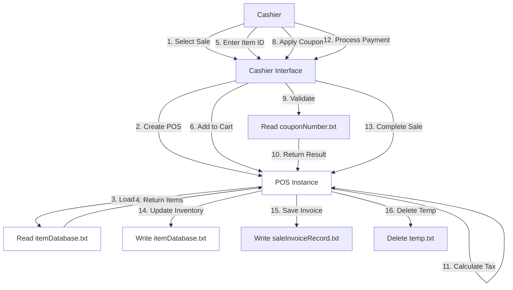
```mermaid
flowchart TD
    A[Cashier] -->|1. Select Sale| B[Cashier Interface]
    B -->|2. Create POS| C[POS Instance]
    C -->|3. Load Items| D[Read itemDatabase.txt]
    D -->|4. Return Items| C
    A -->|5. Enter Item ID| B
    B -->|6. Add to Cart| C
    C -->|7. Update Total| C
    A -->|8. Apply Coupon| B
    B -->|9. Validate| E[Read couponNumber.txt]
    E -->|10. Return Result| C
    C -->|11. Calculate Tax| C
    A -->|12. Process Payment| B
    B -->|13. Complete Sale| C
    C -->|14. Update Inventory| F[Write itemDatabase.txt]
    C -->|15. Save Invoice| G[Write saleInvoiceRecord.txt]
    C -->|16. Delete Temp| H[Delete temp.txt]
    
    style C fill:#ffffff
    style D fill:#ffffff
    style F fill:#ffffff
```

### Reengineered System - Sale Transaction Data Flow

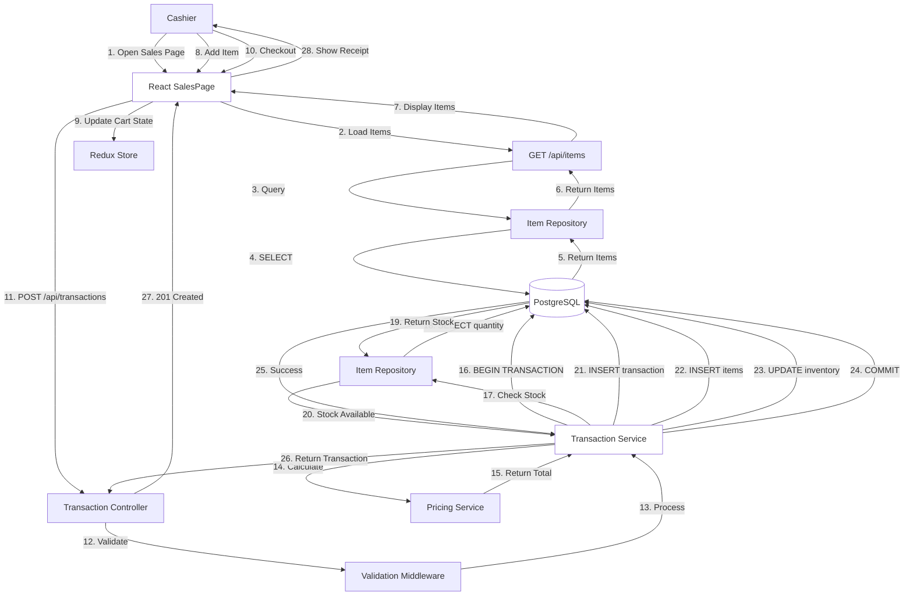
```mermaid
flowchart TD
    A[Cashier] -->|1. Open Sales Page| B[React SalesPage]
    B -->|2. Load Items| C[GET /api/items]
    C -->|3. Query| D[Item Repository]
    D -->|4. SELECT| E[(PostgreSQL)]
    E -->|5. Return Items| D
    D -->|6. Return Items| C
    C -->|7. Display Items| B
    
    A -->|8. Add Item| B
    B -->|9. Update Cart State| F[Redux Store]
    A -->|10. Checkout| B
    B -->|11. POST /api/transactions| G[Transaction Controller]
    G -->|12. Validate| H[Validation Middleware]
    H -->|13. Process| I[Transaction Service]
    I -->|14. Calculate| J[Pricing Service]
    J -->|15. Return Total| I
    I -->|16. BEGIN TRANSACTION| E
    I -->|17. Check Stock| K[Item Repository]
    K -->|18. SELECT quantity| E
    E -->|19. Return Stock| K
    K -->|20. Stock Available| I
    I -->|21. INSERT transaction| E
    I -->|22. INSERT items| E
    I -->|23. UPDATE inventory| E
    I -->|24. COMMIT| E
    E -->|25. Success| I
    I -->|26. Return Transaction| G
    G -->|27. 201 Created| B
    B -->|28. Show Receipt| A
    
    style B fill:#ffffff
    style I fill:#ffffff
    style E fill:#ffffff
```

---

## State Diagrams

### Transaction State Machine

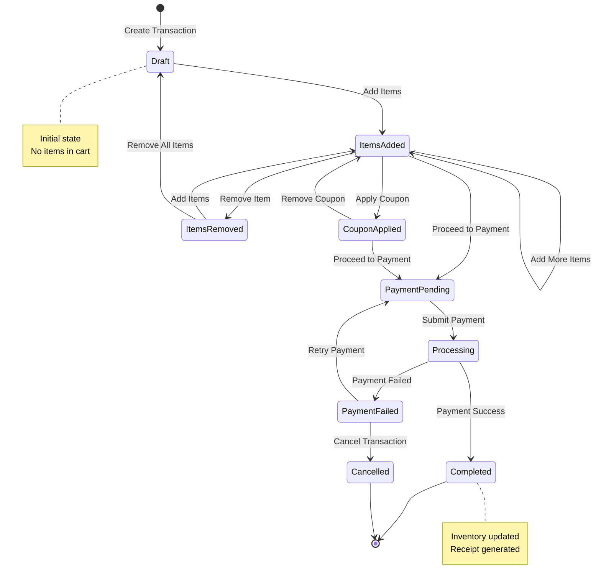
```mermaid
stateDiagram-v2
    [*] --> Draft: Create Transaction
    Draft --> ItemsAdded: Add Items
    ItemsAdded --> ItemsAdded: Add More Items
    ItemsAdded --> ItemsRemoved: Remove Item
    ItemsRemoved --> ItemsAdded: Add Items
    ItemsRemoved --> Draft: Remove All Items
    ItemsAdded --> CouponApplied: Apply Coupon
    CouponApplied --> ItemsAdded: Remove Coupon
    ItemsAdded --> PaymentPending: Proceed to Payment
    CouponApplied --> PaymentPending: Proceed to Payment
    PaymentPending --> Processing: Submit Payment
    Processing --> Completed: Payment Success
    Processing --> PaymentFailed: Payment Failed
    PaymentFailed --> PaymentPending: Retry Payment
    PaymentFailed --> Cancelled: Cancel Transaction
    Completed --> [*]
    Cancelled --> [*]
    
    note right of Draft
        Initial state
        No items in cart
    end note
    
    note right of Completed
        Inventory updated
        Receipt generated
    end note
```

### Rental Lifecycle State

```mermaid
stateDiagram-v2
    [*] --> Active: Create Rental
    Active --> Overdue: Due Date Passed
    Active --> Returned: Return on Time
    Overdue --> Returned: Return Late
    Returned --> [*]
    
    note right of Active
        Item rented
        Customer has item
    end note
    
    note right of Overdue
        Late fees
        accumulating
    end note
    
    note right of Returned
        Late fees calculated
        Inventory restored
    end note
```

### Employee Authentication State

```mermaid
stateDiagram-v2
    [*] --> LoggedOut
    LoggedOut --> Authenticating: Submit Credentials
    Authenticating --> Authenticated: Valid Credentials
    Authenticating --> LoggedOut: Invalid Credentials
    Authenticated --> Active: Access System
    Active --> LoggedOut: Logout
    Active --> SessionExpired: Token Expired
    SessionExpired --> Authenticating: Refresh Token
    SessionExpired --> LoggedOut: Logout
    
    note right of Authenticated
        JWT token issued
        Stored in localStorage
    end note
    
    note right of Active
        Can perform
        transactions
    end note
```

---

## Architecture Comparison Diagram

### Side-by-Side Comparison

```mermaid
graph TB
    subgraph "Legacy Architecture"
        L1[GUI Layer]
        L2[Business Logic]
        L3[File I/O]
        L4[Text Files]
        
        L1 --> L2
        L2 --> L3
        L3 --> L4
    end
    
    subgraph "Reengineered Architecture"
        R1[React Frontend]
        R2[Express API]
        R3[Service Layer]
        R4[Repository Layer]
        R5[PostgreSQL]
        
        R1 --> R2
        R2 --> R3
        R3 --> R4
        R4 --> R5
    end
    
    style L4 fill:#ffffff
    style R5 fill:#ffffff
```

---

## Summary

These diagrams provide comprehensive visualization of:

1. **Architecture Evolution**: From monolithic desktop to three-tier web architecture
2. **Class Structure**: Legacy vs reengineered class relationships
3. **System Interactions**: Sequence diagrams for key operations
4. **Data Models**: ER diagrams showing data relationships
5. **Component Organization**: How system components interact
6. **Deployment Scenarios**: From single desktop to scalable web deployment
7. **Data Flow**: How data moves through the system
8. **State Management**: Transaction and entity lifecycles

All diagrams use Mermaid syntax and can be rendered in:
- GitHub/GitLab markdown
- Documentation tools (MkDocs, Docusaurus)
- VS Code with Mermaid extension
- Online Mermaid editors

These diagrams demonstrate the comprehensive analysis and design improvements made during the reengineering process.

